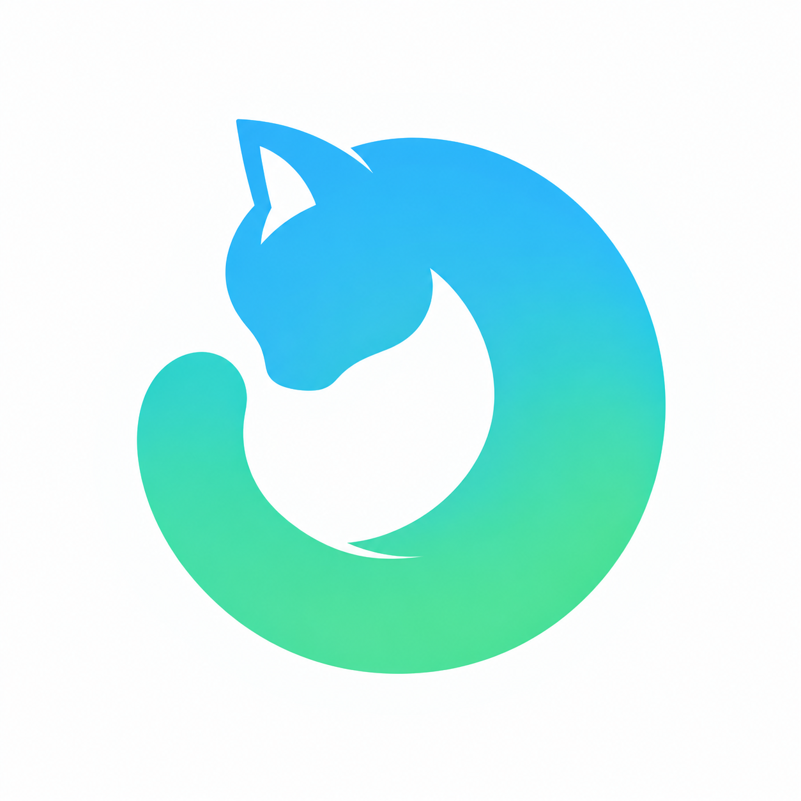
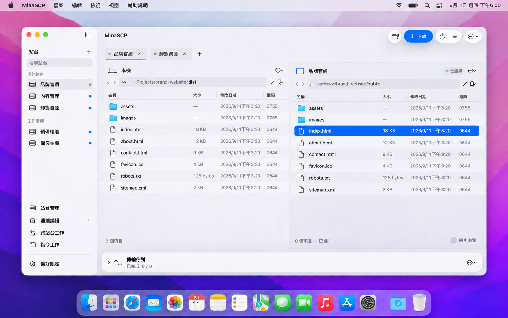

# MinaSCP

### 熟悉的雙欄操作，原生的 Mac 體驗。

在本機與伺服器之間，瀏覽、傳輸、編輯與同步檔案。

**macOS 14+** &nbsp; · &nbsp; **Apple Silicon + Intel** &nbsp; · &nbsp; **SFTP over SSH**

[**下載 1.0.0 →**](https://github.com/BIGWOO/minascp-app/releases/tag/v1.0.0) &nbsp; · &nbsp; [安裝指南](docs/INSTALL.md) &nbsp; · &nbsp; [使用指南](docs/USER-GUIDE.md)

依新版 UI 製作的網站維護 Demo，站台與檔案為虛構情境 · AI 合成桌面展示，非原始螢幕截圖 · <a href="docs/images/glass-light-20260911.jpg">查看實際 UI</a> · <a href="https://media.512pixels.net/downloads/macos-wallpapers-6k/12-Monterey-Light.jpg">Monterey Light 桌布來源</a>

## 讓檔案工作保持順手

| | |
| :--- | :--- |
| **雙欄檔案管理** 本機與遠端並排，篩選、書籤、右鍵與常用快捷鍵隨手可用。 | **多站台、多分頁** 每頁獨立連線與路徑，支援拖曳排序、別名與辨識色彩。 |
| **可續傳的背景佇列** 暫停、恢復、限速與 SHA-256 內容校驗，集中掌握傳輸進度。 | **遠端編輯，自動回存** 以慣用編輯器修改文字檔；偵測遠端變更，遇到衝突先停下來。 |
| **比較與同步** 先看差異，再選擇執行；支援單向、雙向與本機目錄監看。 | **跨站台與遠端指令** 跨站複製、ZIP／tar.gz、自訂指令，執行前確認目標與內容。 |

## 連線資訊，看得清楚

檢視本次連線的加密方式、主機指紋與伺服器能力。支援情況有依據，未知資訊明確標示。

[查看通訊協定與能力的實際畫面 →](docs/USER-GUIDE.md#連線資訊實際畫面)

## 開始使用

1. 從 [GitHub Release](https://github.com/BIGWOO/minascp-app/releases/tag/v1.0.0) 下載 DMG 或 ZIP，將 App 放入 Applications。
2. 開啟「站台管理」，填入主機、使用者與 SSH 驗證方式。
3. 核對主機指紋後連線，即可從雙欄介面操作檔案。

目前下載需要私人儲存庫權限。此版尚未經 Apple 公證，首次開啟方式請見 [安裝指南](docs/INSTALL.md)。

## 深入了解

- [**使用指南**](docs/USER-GUIDE.md) — 快捷鍵、傳輸、編輯、同步與操作限制。
- [**開發與測試**](docs/DEVELOPMENT.md) — 本機建置、Docker 驗證與發佈打包。
- [**1.0.0 發佈紀錄**](docs/RELEASE-1.0.0.md) — 版本內容與實際驗證範圍。

MinaSCP 專注於 SFTP，不提供 SCP、FTP、WebDAV 或 S3。刪除與覆蓋需要明確確認；詳細保護機制與限制請見使用指南。
