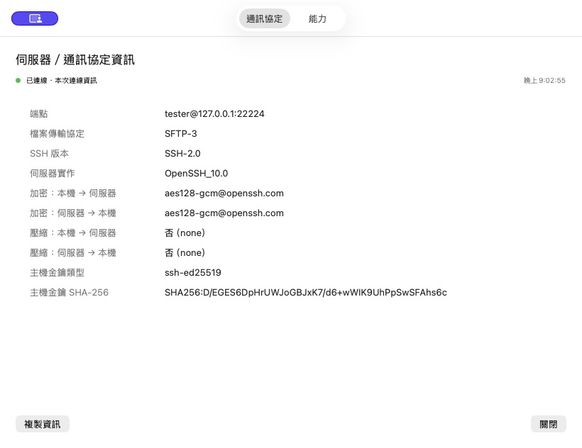
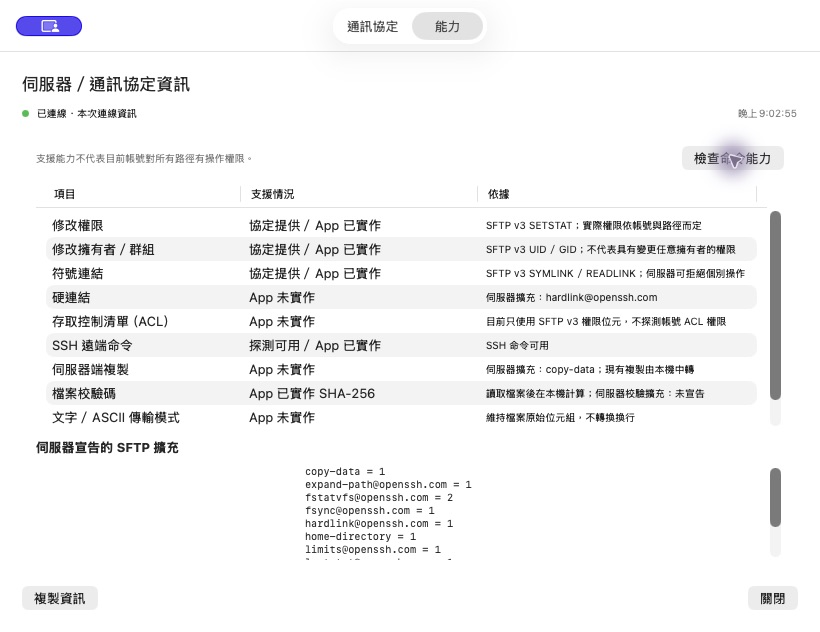

# MinaSCP 使用指南

[← 返回首頁](../README.md) · [安裝說明](INSTALL.md)

## 日常操作

- 側欄雙擊站台開啟分頁；右鍵編輯。⌘N 開啟獨立站台管理視窗，支援分組樹、搜尋、新增、複製、改名、匯入與匯出。
- 每個分頁保有獨立連線、路徑、選取與導覽歷史。重啟恢復分頁但不自動連線或傳輸。
- 雙欄可獨立篩選、排序、前後導覽、跳至主目錄、保存書籤。拖曳欄頭調整順序／寬度，右鍵欄頭切換額外欄位。
- F3 預覽、F4 編輯、F5 傳輸、F6 搬移、F7 建目錄、F8 刪除、Tab 換面板；Return 改名、⌘I 屬性、⌘Delete 刪除、⌘R 重新整理、⇧⌘. 隱藏檔。
- Finder 拖入使用 file URL；遠端拖出保留原生 `NSFilePromiseProvider`。拖曳開始即固定來源連線和路徑，拖至資料夾列以該目錄為目的地。
- 工具列、右鍵與功能鍵共用命令層。支援改名、兩端搬移、同端複製／搬移、權限、UID/GID、符號連結與名稱遞迴搜尋。

## 分頁管理與連線資訊

分頁右鍵固定操作被點擊的分頁，可連線／取消連線／重新連線／中斷、重複、更名、設定色彩、另存站台，以及關閉其他／右側分頁。別名與色彩只屬於此分頁，可恢復站台預設；另存站台先開草稿，按儲存前不新增站台。拖曳分頁到目標的左／右半部調整順序，重啟保留。右鍵「已開啟分頁」列出名稱、目前分頁勾選及連線狀態。

⌘T 開啟站台管理、⇧⌘D 重複目前分頁、⇧⌘W 關閉目前分頁。重複分頁保留雙欄路徑、篩選、排序、書籤及導覽歷史，清除選取；已連線來源建立獨立連線，未連線來源不自動連線。命令／封存讀回與屬性寫入期間禁止關閉或斷線；批次關閉先整批檢查。獨立背景傳輸、跨站台、遠端編輯與同步監看會提示後繼續。

已連線分頁右鍵「伺服器／通訊協定資訊」開啟通訊協定、能力兩頁。協定頁來自本次 SFTP 交握及 OpenSSH 協商白名單資料；顯示雙向加密／壓縮與 SHA-256 主機指紋。資訊綁定開啟時的連線，切換分頁不改內容，斷線後保留上次資訊。能力頁區分協定、伺服器宣告與 App 實作；唯讀「檢查命令能力」沿用本次連線快取。複製資訊包含兩頁畫面資料，不包含原始 SSH 診斷或登入秘密。ProxyJump／混合診斷無法可靠辨識時顯示未知。

本批不提供可用空間查詢、工作階段 URL／程式碼、命名工作區或隱藏標籤列；既有跨站台本機暫存容量檢查保留。驗收紀錄見 [分頁與資訊驗收](tab-acceptance-20260910.md)。

## WinSCP 風格右鍵操作

- 檔案、資料夾、多選與空白處各用不同選單；空白處操作目前目錄，不動原選取。不可用命令灰化，右鍵後鍵盤焦點留在該面板。
- 空白處提供前往路徑／上層／根目錄／家目錄／歷史／書籤、重新整理、篩選、複製目錄路徑，以及新增檔案／資料夾／連結。新檔會直接進入既有編輯器回存流程。
- ⌘C／⌘V 支援 App 內本機與遠端檔案複製貼上、Finder 檔案貼入。本機同時提供標準 file URL；遠端剪貼簿只有站台識別、端點摘要與路徑，不含登入秘密，端點改變或不同站台時禁止貼上。遠端貼到 Finder 請沿用拖放。
- 製作複本／移動到支援多選；單選指定完整目的路徑，多選指定既有目的資料夾。工作進入背景佇列，同名只提供略過或自動改名；同端移動不覆蓋。遠端複本資料經由 Mac 串流讀寫，不要求 shell 或伺服器端 cp。
- 屬性整合資訊、RWX、八進位、UID:GID；混合值只改已編輯欄位，遞迴預設關閉、不跟隨連結。每次套用前保留原值，逐項讀回；視窗內可還原該次原值，關閉視窗後不保留還原工作階段。
- OpenSSH 屬性寫入優先使用 lsetstat 擴充；舊伺服器退回先檢查種類再 SETSTAT，無法保證防止其他程序在檢查與寫入之間替換路徑。
- 日常右鍵實測見 [右鍵驗收紀錄](context-menu-acceptance-20260910.md)；進階功能見 [跨站台與命令驗收](advanced-acceptance-20260910.md)。

## 跨站台、封存與自訂指令

遠端右鍵「製作複本…」預設目前站台，亦可選另一個已保存站台。跨站台先按「掃描與估算」，確認目的資料夾和暫存需求，再開始下載→校驗→上傳→獨立讀回；來源保留。同名僅略過或自動改名，不覆蓋／合併。暫存需求為內容大小加 10%，至少另留 64 MiB。側欄「跨站台工作」提供暫停、取消、恢復與清理；失敗保留暫存，全部驗證成功才自動清理。端點、來源或暫存不符時停止，不混用新舊內容。清理後不能恢復。

遠端檔案／資料夾右鍵「檔案自訂指令」提供 Touch、ZIP、tar.gz、解壓縮與適用範本。空白處「目錄自訂指令」提供目錄範本與臨時指令。首次使用檢查本次連線的 shell／工具，選單更新結果；可手動重新檢查。SFTP-only 明確停用命令，仍可跨站台複製，不自動改用本機處理。

所有命令先顯示站台、工作目錄、選取與實際指令，按「執行」才開始。獨立 SSH 收集 stdout、stderr、結束碼；每個串流最多保留尾端 2 MiB。預設逾時 600 秒，可於預覽改為 1–86400 秒。停止只終止本機 SSH，遠端狀態可能未確認；不自動重試，也不宣稱命令可還原。側欄「指令工作」可查看輸出及保留的遠端暫存路徑。

壓縮使用遠端 zip／tar，保留而不跟隨符號連結。ZIP 須有 zip、unzip；tar.gz 須有 tar。解壓縮須有 Python 3，只接受單一 ZIP／tar.gz，拒絕路徑穿越、重複項目、符號／硬連結與特殊檔案；最多 100,000 個成員、100 GiB 展開大小。先產生獨立暫存，成功後不覆蓋改名；解壓縮不合併既有資料夾。Touch 使用 `touch -c`，不重建已消失的選取檔案。

偏好設定 →「自訂指令範本…」集中管理名稱、情境、整批／逐項與逾時。支援 `{path}`、`{name}`、`{directory}`、`{paths}`；各自引用，每個變數前後須留空白，勿自行加引號或嵌入 shell 替換。未知變數、錯誤情境與無效逾時會阻止執行。這是命令範本，不提供互動終端機、密碼變數或 sudo 代填；請勿在範本寫入秘密，範本和實際指令會保存於本機 JSON。

進階資料使用 `cross-site-v1.json`、`command-templates-v1.json`、`command-history-v1.json`；重啟不自動執行。跨站台暫存位於 `cross-site-staging/<工作 UUID>/`。命令失敗的遠端暫存只列出明確路徑，請查明遠端是否仍執行再自行清理。若進階工作仍在執行，先從工作清單停止／暫停，再結束 App。

## 傳輸與資料保護

背景傳輸與瀏覽使用分離通道，預設最多兩個背景傳輸，可調整並行數及限速。佇列顯示工作／目前檔案進度、速度、估計剩餘時間，提供暫停、取消、續傳、重試與暫存資訊。

同名預設詢問，支援覆蓋、略過、自動改名、僅較新檔及套用本批。先寫唯一 `.minascp-*` 暫存，再 SHA-256 校驗與完成改名；沒有覆蓋授權時使用不覆蓋改名。原子覆蓋依賴伺服器 `posix-rename@openssh.com`，不支援時停止並保留暫存。

續傳重新檢查來源完整雜湊與部分檔案前綴；來源改變或部分檔損壞會停止。重啟後未完成工作保持暫停，由使用者恢復。殘留暫存列於工作「資訊」，不自動清理不明檔案。

遠端刪除需確認站台、完整路徑與項目數，採永久刪除；本機刪除移到垃圾桶。遞迴不跟隨符號連結。兩端搬移先複製及校驗，再另行確認移除來源；有略過項目、來源新增／修改或目的地校驗不同，均保留來源。

## 登入與設定

支援 SSH 金鑰、Agent、密碼與 OpenSSH 互動提示，以及 SSH config、ProxyJump、連線逾時、Keepalive 與手動重連。首次主機金鑰由 App 提示確認；已知金鑰改變時拒絕連線。

密碼／私鑰密語預設不保存，僅勾選時使用 macOS Keychain；驗證碼不快取。秘密不寫入站台 JSON、命令列或診斷摘要。新信任的主機記錄使用 `~/.ssh/minascp_known_hosts`；同時尊重系統既有 known_hosts。

設定位於 `~/Library/Application Support/com.mina.scp/`，分為站台、偏好設定、工作區、佇列、編輯副本與同步基準。原子寫入、目錄 0700／JSON 0600。舊站台 JSON 升級前先備份並驗證；讀取或版本不支援時禁止覆寫。原 `~/Library/Application Support/MinaSCP/` 不修改。

舊站台匯入先預覽、預設全部不勾選。Windows 路徑、PPK、缺少金鑰、不支援協定會顯示警告；不複製舊主機信任或秘密，也不自動登入。

## 遠端編輯與同步

遠端文字檔雙擊下載到獨立工作副本，預設以 VS Code 開啟。UTF-8 文字上限 16 MiB；原子儲存與快速連續儲存經穩定檢查後自動回傳。回存保留遠端檔案權限，上傳前及完成前檢查遠端基準雜湊。

遠端內容也變更時停止回存，提供比較、重新下載（先備份本機修改）、另存或明確覆蓋。失敗與重啟保留工作副本，重啟後需手動恢復監看。F3 可預覽文字及圖片／PDF（後兩者上限 32 MiB），其他檔案顯示屬性資訊。

「比較／同步」先掃描兩端內容並顯示可勾選清單，支援單向、雙向與 glob 排除規則。預設不刪除；額外檔案刪除必須另勾選並確認。雙向不推測刪除意圖，兩端變更列為衝突。執行時重新驗證預覽與每個項目，資料夾內排除項目不會被連帶刪除。

本機監看每次需手動啟動，只傳播新增／修改，不傳播刪除；遠端同時改變時停止。停止按鈕可取消掃描／執行／監看。

## 驗收與限制

完整實測範圍與人工檢查項目見 [驗收紀錄](acceptance-20260910.md)。歷史紀錄描述各次測試當時的狀態；1.0.0 發佈驗證另見 [發佈紀錄](RELEASE-1.0.0.md)。

- 只支援 SFTP；不包含 SCP、FTP/FTPS、WebDAV 或 S3。
- SFTP v3 沒有伺服器端「內容版本比較後交換」原語：覆蓋前雜湊檢查可偵測已發生的變更，但無法鎖住其他客戶端在最後檢查與改名間的修改。需要多人同時寫入的目錄仍應使用外部版本／鎖定機制。
- 目錄同步與監看使用內容雜湊，遠端大目錄會產生讀取流量；監看以三秒輪詢，不是 OS 級事件串流。
- 中止傳輸保留暫存與工作副本。跨端搬移完成後若未確認刪除來源，來源會保留；重啟不自行補做刪除。
- Finder 跨 App 多選／資料夾拖曳、拖曳中切換分頁的手感仍列為人工驗收項目，未把自動化工具無法完成的拖曳宣稱通過。

## 參考

- [SFTP v3 協定草案](https://www.ietf.org/archive/id/draft-ietf-secsh-filexfer-02.txt)
- [OpenSSH 協定擴充](https://github.com/openssh/openssh-portable/blob/master/PROTOCOL)
- [Apple NSFilePromiseProvider](https://developer.apple.com/documentation/appkit/nsfilepromiseprovider)

## 連線資訊實際畫面

以下為本機測試站台的實際驗收截圖，與 README 的 AI 情境示意圖分開保留。

<table>
<tr>
<td width="50%"></td>
<td width="50%"></td>
</tr>
<tr><td align="center">通訊協定與主機指紋</td><td align="center">伺服器能力與擴充</td></tr>
</table>
