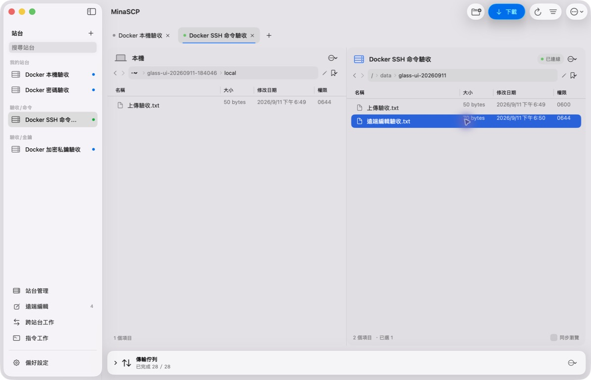
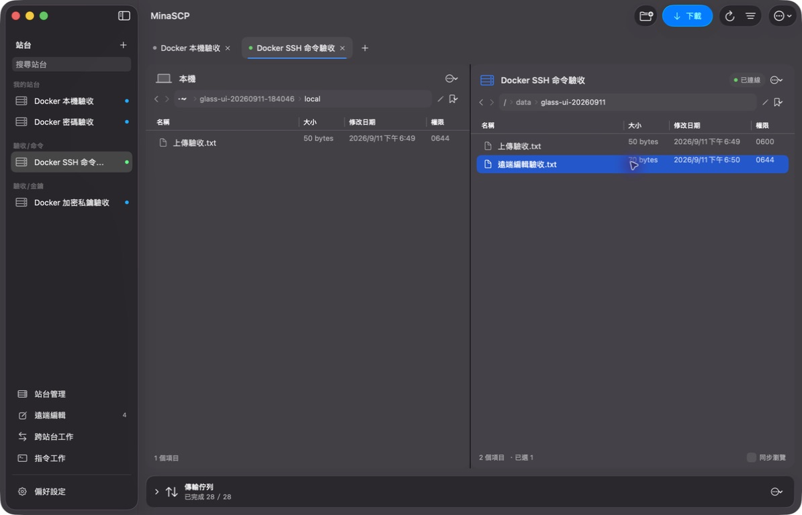

# 玻璃外觀本機驗收 — 2026-09-11

實作與本機建置已完成；Finder 跨 App 拖放、後方內容混色及部分視窗操作仍待人工驗收。程式與文件分批提交，不包含推送或發版。

## 交付範圍

- 主畫面改為原生側欄與工具列、雙欄麵包屑路徑、獨立名稱篩選及可收合傳輸摘要；保留原 NSTableView、命令、拖放與 SFTP 邏輯。
- 外觀集中於 `Appearance.swift`。明亮／深色／跟隨系統、0–100% 背景透明度、即時預覽、恢復預設，以及無障礙優先處理。
- 設定版本仍為 v1，新增欄位向後相容；舊設定缺少新欄位時使用明亮／50%。舊欄位不採靜默重設，損壞原檔仍禁止覆寫。外觀保存延遲 300 毫秒，另有關閉與正常退出補存。

## 已取得的證據

環境為 Apple Silicon、macOS 26.7、SDK 26.5；最低部署版本仍為 macOS 14。

- `MINASCP_DOCKER=1 MINASCP_DOCKER_TEST=1 swift test`：63 項，61 通過、2 項依條件跳過、0 失敗。沒有將跳過的壓力／斷線測試算成通過。
- 新增 8 項外觀測試，覆蓋舊設定、保存／重載、範圍限制、無障礙遮罩、延遲保存、損壞原檔保護，以及不重建工作區／不重新配置傳輸佇列。最後的外觀預覽修正後重跑 8 項皆通過。
- `scripts/build-app.sh` 完成本機 App 打包與 ad-hoc 簽章驗證；最後的獨立視窗標題列修正已重建並開啟驗證。`git diff --check` 通過。
- 實際操作明亮、深色及跟隨系統；滑桿 0／50／100；正常退出後還原外觀值。切換明暗時，既有 Docker 連線及選取仍保留。
- `⌘L` 輸入本機／遠端完整路徑、Return 導覽、`⌘F` 遠端名稱篩選、Escape 清空並回到表格、`⌘A` 多選、原生右鍵檔案／多選命令與子選單取消均有介面讀回。
- 一般 1320×850、縮窄至 1000 點寬、側欄收合／還原與傳輸佇列展開／收合均已操作。舊偏好中的展開值在載入時保留。
- 深色偏好設定與獨立站台管理視窗已截圖；站台管理標題列原先出現淺色區塊，修正後已讀回深色原生標題列。
- 系統「減少透明度」實測：滑桿停用、說明出現、原本 50% 保留；關閉後滑桿恢復。增加對比時同樣顯示對應提示。兩項系統設定已回復測試前的關閉狀態。
- 執行中視窗檢查確認 `isOpaque = false`、透明 window background、覆蓋主視窗的 NSVisualEffectView 採 behind-window 混合；100% 時語意色遮罩 alpha 為 0.15。這是材質配置證據，不等於桌布混色的視覺驗收。

## 實際傳輸與回存

只使用專案既有 loopback Docker 站台 `127.0.0.1:22224` 及專用 `/data/glass-ui-20260911` 目錄。啟動兩組既有測試容器，未寫入外部站台。

- 使用 App 的 F5 上傳及下載 `上傳驗收.txt`，佇列兩次皆顯示完成／內容校驗完成。來源、Docker 掛載目錄及下載檔獨立 SHA-256 比對一致：`66e20d4200e63b48d3cf84fcc8a3ad8e9c9326d4a478a4e78ae94929dd7eb516`。
- 使用 F4 建立 `遠端編輯驗收.txt` 的工作副本；以檔案寫入模擬編輯器儲存後，App 自動回存並顯示「儲存並校驗完成」。遠端與工作副本 SHA-256 一致：`ba56ffd9597529f9a9871bb0ef48a9d0cb2a9c1f201d9dd4155daa98ee10f6b2`，原權限 `0644` 保留。沒有把此項說成外部編輯器鍵盤操作驗收。

## 實際畫面

以下為本機 App 單視窗截圖，主畫面皆使用透明度 100%。不是設計稿，也未合成桌布或選單。

| 明亮 | 深色 |
| --- | --- |
|  |  |

[外觀設定](images/glass-settings-20260911.jpg) · [減少透明度](images/glass-accessibility-20260911.jpg) · [深色站台管理](images/glass-site-manager-dark-20260911.jpg)

## 尚未通過的人工項目

- **Finder 雙向拖放：**已開啟專用 Finder 來源資料夾，嘗試兩方向跨視窗拖曳，沒有傳輸或目的檔證據；控制工具另在視窗拖曳回報 `noWindowsAvailable`。不以 F5 傳輸或單元測試替代。已請使用者在真實畫面確認。
- **原生右鍵選單截圖：**選單及子選單可操作、命令可讀回，但擷取時工具回報 `Screenshot unavailable`，未取得可交付的選單影像。保留文字讀回，沒有合成選單截圖。
- **材質與視窗互動：**目前單視窗截圖未能確認桌布／後方視窗的實際混色。精確 1000×680、分隔線拖曳、視窗拖移、全螢幕、分頁拖曳排序與更多跨 App 手感仍需人工確認；沒有由程式設定或編譯推定通過。
- **版本相容：**未在 macOS 14／15 或 Intel 實機執行。原生材質 fallback 保留，但實機外觀、無障礙及輸入行為仍待驗證。

## 本機成果與回復

- 新 App：`build/debug/MinaSCP.app`。
- 改版前 1.0.0 App：`build/backups/glass-before-20260911/MinaSCP.app`，由 14:04 的 release 建置另存並通過簽章驗證。原 release App 亦保留。
- 原設定備份：`output/glass-ui-20260911-184046/settings-backup/`；只備份，不覆蓋目前設定。
- 原始測試記錄、額外截圖、材質檢查與雜湊讀回：`output/glass-ui-20260911-184046/`，其中 `transfer-evidence.json` 記錄獨立檔案比對。輸出與測試資料沒有納入 Git。
- 回復 App 前先正常結束目前版本，再開啟上述備份。舊版可忽略 v1 中新增的外觀欄位，不需為回復介面重設站台或傳輸資料。
